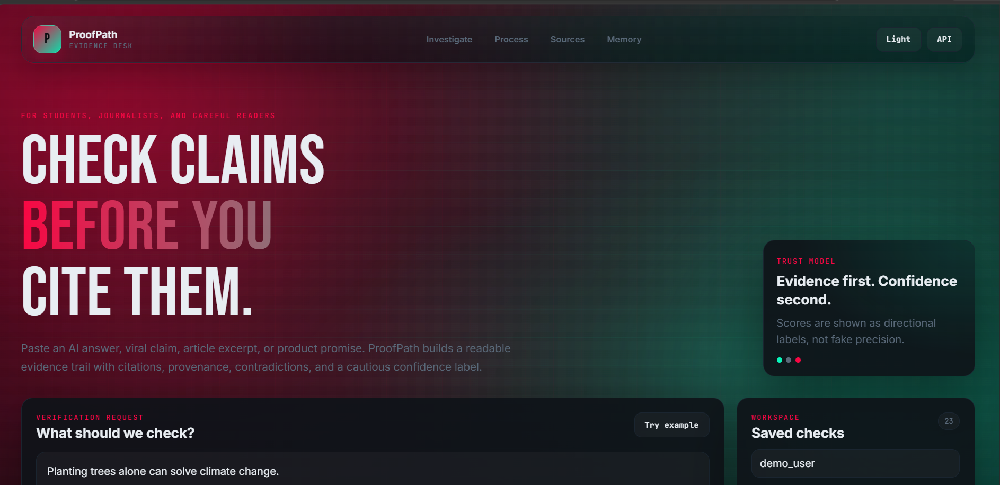
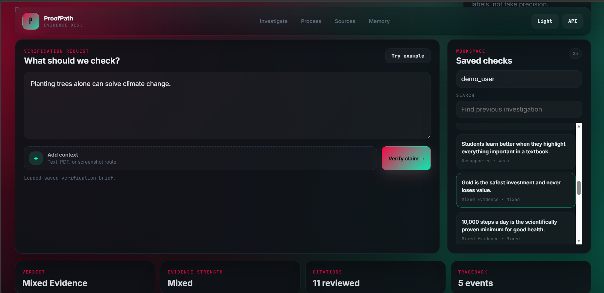
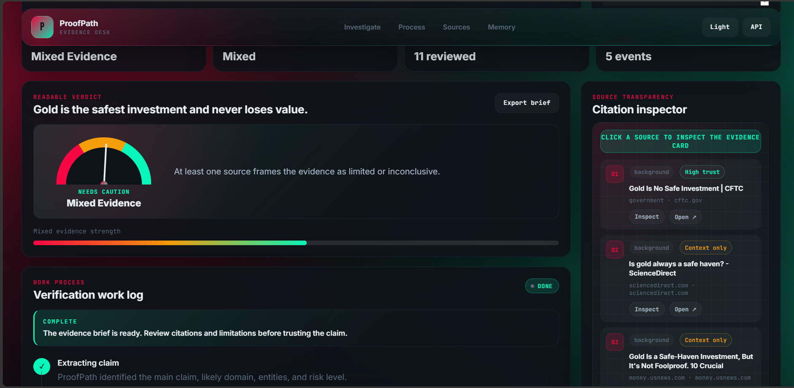
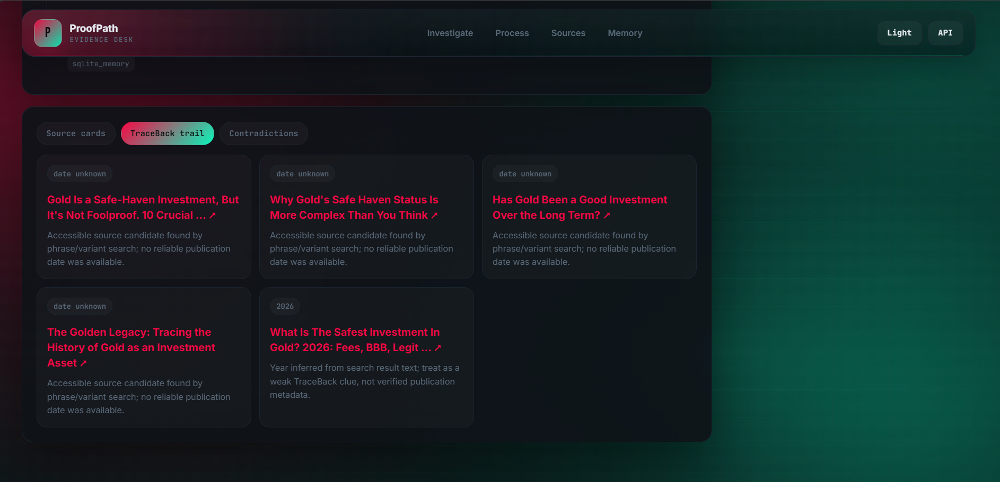
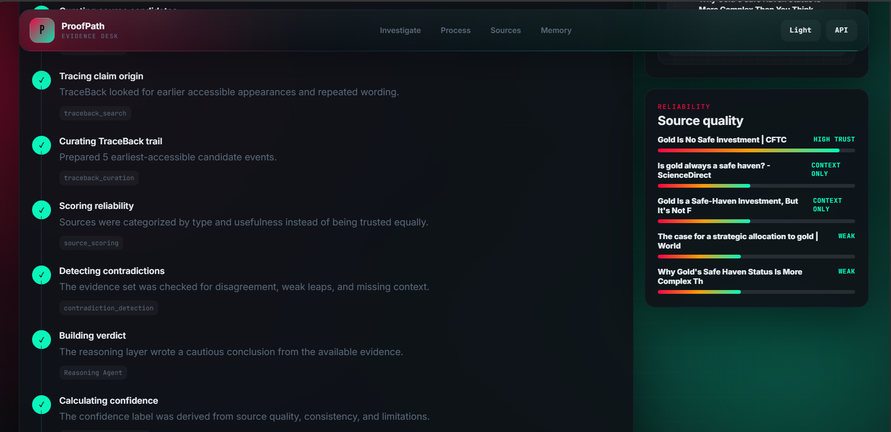

# ProofPath AI

**Trust evidence, not vibes.**

ProofPath AI is an agentic investigation platform that verifies claims by building an evidence trail before producing a verdict. It is designed around LLM-assisted claim extraction, LangGraph orchestration, tool selection, source quality scoring, TraceBack-style provenance analysis, contradiction detection, confidence scoring, SQLite memory, and shareable reports.

## What It Does

ProofPath runs a structured investigation instead of a single prompt-response call:

1. Extracts the main claim, subclaims, entities, domain, and risk.
2. Plans an investigation and chooses tools.
3. Retrieves web, academic, and TraceBack-style provenance evidence.
4. Scores source quality and stance.
5. Detects contradictions and weak evidence.
6. Uses an LLM Reasoning Agent to synthesize a cautious verdict from the retrieved evidence.
7. Calculates confidence from transparent factors.
8. Persists the case, evidence, timeline, contradictions, and report in SQLite.
9. Presents the investigation in a dashboard rather than a chatbot UI.

The live search layer uses Tavily when `TAVILY_API_KEY` is configured and falls back to DuckDuckGo HTML search. If evidence retrieval fails, ProofPath does not fabricate sources; it returns a low-confidence result with the failure recorded in the investigation.

If `LLM_PROVIDER` and a matching API key are configured, the final reasoning step calls a real LLM API. Supported providers are:

- `gemini` with `GEMINI_API_KEY`
- `openai` with `OPENAI_API_KEY`
- `anthropic` with `ANTHROPIC_API_KEY`

When no LLM key is available, the app keeps running with a deterministic fallback so local demos do not crash.

## Why This Is Agentic

ProofPath is not a basic chatbot. It follows this autonomous workflow:

```text
User claim or uploaded evidence
-> Claim Extraction Agent
-> Planner Agent chooses tools
-> Evidence Retrieval Tools
-> TraceBack Tool
-> Source Quality Tool
-> Contradiction Tool
-> LLM Reasoning Agent
-> Confidence Tool
-> Report Tool
-> SQLite Memory
```

The planner decides when academic search and TraceBack are needed based on claim domain and risk. Each tool returns structured data that the next step uses.

The backend workflow is implemented with `langgraph.graph.StateGraph` in `backend/app/workflow.py`, with named nodes for extraction, planning, retrieval, TraceBack, scoring, contradiction detection, reasoning, confidence, report generation, and memory save.

## Task 5 Requirement Mapping

| Requirement | ProofPath Implementation |
|---|---|
| LLM API | Gemini, OpenAI, or Anthropic-powered Claim Extraction and Reasoning Agents extract nuanced claims and synthesize the final verdict from retrieved evidence, source scores, and contradictions. |
| Tools | Web search, academic search, TraceBack search, source scoring, contradiction detection, confidence calculator, file parser, OCR, CSV summarizer, and report generator. |
| Memory | SQLite stores cases, extracted claims, sources, TraceBack events, contradictions, activity logs, reports, and user preferences across sessions. |
| Multi-step workflow | LangGraph StateGraph: claim extraction -> planning -> tool selection -> evidence retrieval -> TraceBack -> source scoring -> contradiction detection -> LLM reasoning -> confidence scoring -> report generation -> memory save. |
| Frontend | FastAPI-served dashboard at `http://127.0.0.1:8000` with real-time workflow visualization, citations, TraceBack, contradiction view, file upload, case memory, and export. |
| Autonomous decision-making | Planner routes health/academic/high-risk claims to academic search and TraceBack, then downstream agents score evidence and decide whether the verdict should be supported, mixed, misleading, or unresolved. |

## Tools Used

- Web search: Tavily or DuckDuckGo fallback for external evidence
- Academic search: PubMed/Scholar/arXiv-focused search query routing
- TraceBack search: exact phrase, shortened claim, origin, myth, and fact-check searches
- Source scoring: classifies source type, stance, and credibility
- Contradiction detection: flags disagreement or weak evidence
- Confidence calculator: combines source quality, consistency, primary-source strength, recency, and TraceBack clarity
- File processing: text, Markdown, CSV summaries, PDFs, and OCR image uploads
- Report generation: Markdown and PDF evidence brief export

## Memory Implementation

ProofPath uses SQLite memory. It stores:

- previous cases by user
- extracted claims
- source cards
- TraceBack timeline events
- contradiction records
- agent activity logs
- generated reports
- user preferences

## Project Structure

```text
backend/app/
  agents/      # Case manager and specialist agents
  api/         # FastAPI routes
  config/      # Runtime settings
  database/    # SQLite schema and persistence
  memory/      # SQLite case memory adapter
  static/      # Built frontend served by FastAPI
  tools/       # Search, scoring, parsing, reporting tools
  utils/       # Shared helpers
frontend/      # React/Vite/Tailwind source frontend
tests/         # Backend tests
docs/          # Product, architecture, and implementation specs
```

## Local Setup

```powershell
python -m venv .venv
.\.venv\Scripts\Activate.ps1
pip install -r requirements.txt
copy .env.example .env
```

## Run The App

```powershell
uvicorn app.main:app --app-dir backend --reload
```

Then open:

- Dashboard: `http://127.0.0.1:8000/`
- Health check: `http://127.0.0.1:8000/api/health`
- API docs: `http://127.0.0.1:8000/docs`

## Screenshots

### 1. Home Page
Main landing view of ProofPath with the verification console and workspace.



### 2. Verification Request
The claim input area where users start an investigation.



### 3. Verdict and Citation Inspector
Readable verdict view showing evidence strength and inspectable source cards.



### 4. TraceBack Trail
TraceBack interface used to explore earlier accessible appearances and source trail.



### 5. Process and Source Quality
Verification workflow timeline along with source reliability scoring.




## Frontend Development

The production app is served by FastAPI from `backend/app/static`. The React source lives in `frontend/` and builds into that static directory:

```powershell
cd frontend
pnpm install
pnpm build
cd ..
uvicorn app.main:app --app-dir backend --reload
```

If package installation is blocked on a local machine, the checked-in static dashboard still runs from the FastAPI app.

## Key Endpoints

- `POST /api/investigate`
- `GET /api/cases?user_id=demo_user`
- `GET /api/cases/{case_id}`
- `GET /api/report/{case_id}`
- `GET /api/report/{case_id}/pdf`
- `POST /api/upload`
- `POST /api/preferences`

## Testing

```powershell
pytest
```

## Evidence Policy

ProofPath never invents citations. TraceBack output is phrased as earliest accessible source candidates, not guaranteed origin discovery. Health, legal, and financial outputs are evidence summaries, not professional advice.

## Documentation

The source-of-truth docs are in `docs/`, including:

- Product requirements
- Technical requirements
- Architecture
- Agent design
- Tool design
- LangGraph workflow
- Memory design
- UI/UX specification
- Database schema
- API specification
