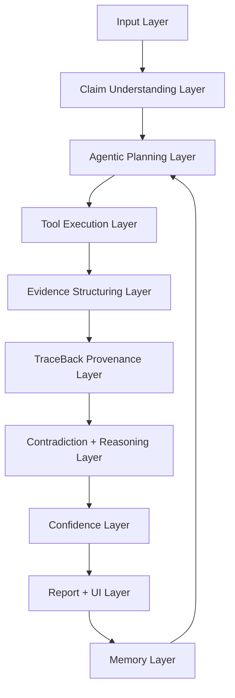
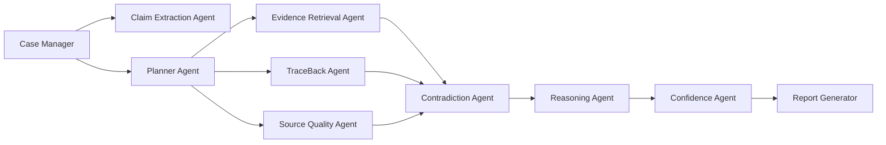
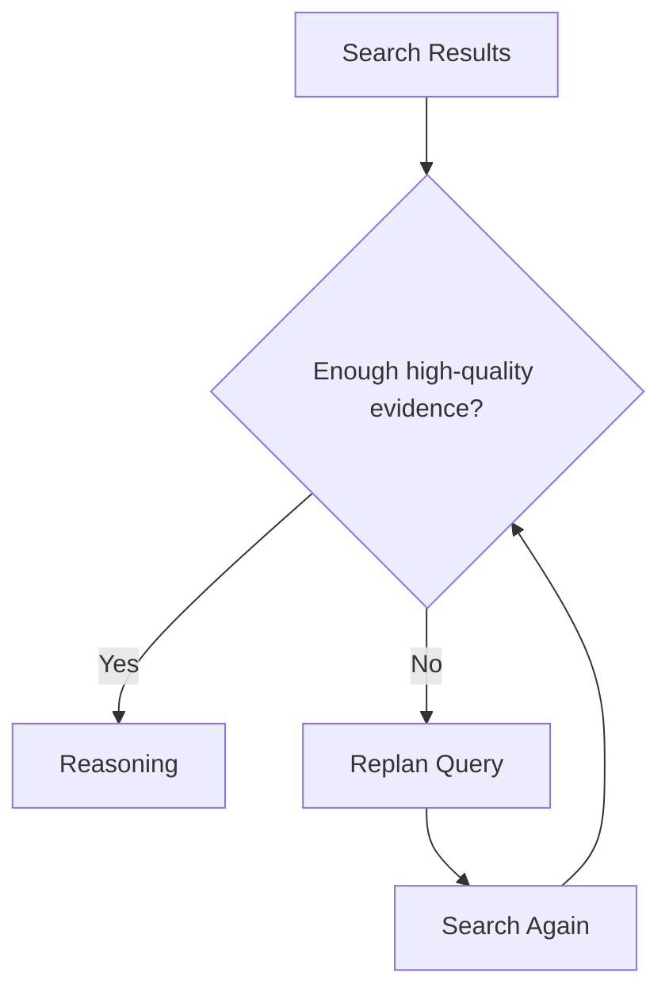

# Architecture Document: ProofPath AI + TraceBack Features

## 1. Architecture Goal
The system should behave like an autonomous evidence investigator.

It must:
- extract claims,
- plan the investigation,
- select tools,
- retrieve evidence,
- trace origins,
- detect contradictions,
- calculate confidence,
- generate a final report,
- remember previous investigations.

## 2. High-Level System



## 3. Layers

### 3.1 Input Layer
Accepts:
- plain text claims,
- long articles,
- screenshots,
- PDFs,
- pasted AI answers,
- product claims,
- social media claims.

### 3.2 Claim Understanding Layer
Tasks:
- identify main claim,
- identify subclaims,
- classify domain,
- extract entities,
- detect urgency/risk.

### 3.3 Agentic Planning Layer
The planner decides the investigation strategy.

Example:
For a health claim:
- search PubMed,
- search medical authorities,
- search web,
- trace origin,
- detect contradiction.

For a product claim:
- search company page,
- search independent reviews,
- search scientific support,
- check regulatory warnings.

### 3.4 Tool Execution Layer
Runs tools:
- search,
- academic search,
- PDF parser,
- OCR,
- source scorer,
- timeline builder,
- report generator.

### 3.5 Evidence Structuring Layer
Turns messy search output into structured evidence.

Fields:
- source title,
- URL,
- source type,
- claim stance,
- quality score,
- useful quote,
- date,
- relevance.

### 3.6 TraceBack Provenance Layer
This is the integrated TraceBack AI feature.

It tries to answer:
- where did this claim appear earlier?
- has the wording changed?
- who repeats it?
- is there a primary source?
- is the claim based on evidence or repetition?

### 3.7 Contradiction + Reasoning Layer
Compares:
- source vs source,
- claim vs evidence,
- old versions vs current versions,
- marketing language vs primary data.

### 3.8 Confidence Layer
Generates confidence using:
- evidence quality,
- agreement across sources,
- primary source availability,
- source recency,
- traceback clarity,
- contradiction severity.

### 3.9 Report + UI Layer
Presents:
- verdict,
- evidence trail,
- source table,
- contradiction map,
- traceback timeline,
- confidence score,
- downloadable report.

### 3.10 Memory Layer
Stores:
- previous claims,
- verdicts,
- sources,
- claim variants,
- user preferences,
- case reports.

## 4. Multi-Agent Design



## 5. Data Objects

### Claim Object
```json
{
  "claim_id": "claim_001",
  "text": "Cold water after meals causes cancer",
  "domain": "health",
  "entities": ["cold water", "meals", "cancer"],
  "risk_level": "high"
}
```

### Evidence Object
```json
{
  "source_id": "src_001",
  "title": "Cancer Myth Article",
  "url": "https://example.com",
  "source_type": "medical_authority",
  "stance": "refutes",
  "quality_score": 0.91,
  "summary": "No evidence supports the claim."
}
```

### TraceBack Event
```json
{
  "date": "2018-02-11",
  "claim_version": "Cold water causes cancer after eating",
  "source": "blog post",
  "quality": "low",
  "notes": "Repeated without primary citation"
}
```

## 6. LangGraph Node Plan

Nodes:
1. `extract_claim`
2. `plan_investigation`
3. `retrieve_evidence`
4. `trace_origin`
5. `score_sources`
6. `detect_contradictions`
7. `reason_verdict`
8. `score_confidence`
9. `save_memory`
10. `generate_report`

Conditional edges:
- If input has image → OCR node
- If input has PDF → PDF parser node
- If domain is health → PubMed node
- If domain is academic → Semantic Scholar/arXiv node
- If confidence is low → additional search loop
- If contradictions are high → deeper investigation loop

## 7. Retry Loop



## 8. MVP Architecture
For 3 days:

- Streamlit frontend
- Python backend functions
- LangGraph StateGraph workflow
- Tavily/DuckDuckGo search
- SQLite memory
- Markdown and PDF report generation
- Optional ChromaDB future upgrade

## 9. Portfolio Architecture
For LinkedIn/GitHub:

- Next.js frontend
- FastAPI backend
- LangGraph
- SQLite memory, with ChromaDB as a future upgrade
- React Flow evidence graph
- PDF report export
- Authentication later
- Hosted demo
