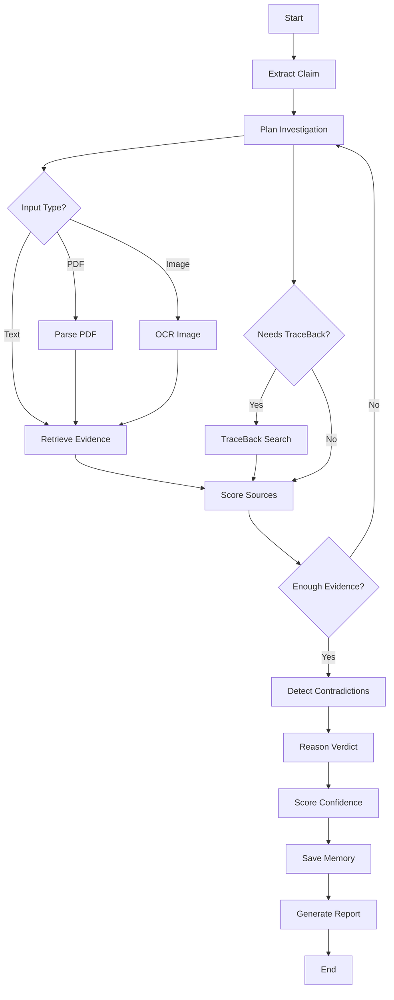

# LangGraph Workflow Specification

## 1. Goal
Use LangGraph to show that ProofPath AI is not a single LLM call. It is a stateful multi-step investigation workflow.

## 2. Nodes

```text
extract_claim
plan_investigation
route_tools
retrieve_evidence
traceback_search
score_sources
detect_contradictions
reason_verdict
score_confidence
save_memory
generate_report
```

## 3. State

```python
from typing import TypedDict, List, Dict, Optional

class ProofPathState(TypedDict):
    case_id: str
    user_id: str
    raw_input: str
    files: List[str]
    claim: Dict
    plan: Dict
    selected_tools: List[str]
    evidence: List[Dict]
    traceback_timeline: List[Dict]
    source_scores: List[Dict]
    contradictions: List[Dict]
    verdict: Optional[str]
    confidence: Optional[float]
    report_markdown: Optional[str]
    memory_refs: List[str]
    errors: List[str]
```

## 4. Conditional Routing

### If input contains file:
Route to:
- OCR node for images
- PDF parser for PDFs

### If claim domain is health:
Route to:
- PubMed
- medical authority search
- general web search

### If claim appears viral:
Route to:
- TraceBack Agent
- web search with exact phrase
- variant search

### If source quality is low:
Route to:
- replan search query
- search primary sources

### If contradictions are high:
Route to:
- deeper retrieval loop

## 5. Workflow Diagram



## 6. Pseudocode

```python
workflow = StateGraph(ProofPathState)

workflow.add_node("extract_claim", extract_claim)
workflow.add_node("plan_investigation", plan_investigation)
workflow.add_node("retrieve_evidence", retrieve_evidence)
workflow.add_node("traceback_search", traceback_search)
workflow.add_node("score_sources", score_sources)
workflow.add_node("detect_contradictions", detect_contradictions)
workflow.add_node("reason_verdict", reason_verdict)
workflow.add_node("score_confidence", score_confidence)
workflow.add_node("save_memory", save_memory)
workflow.add_node("generate_report", generate_report)

workflow.set_entry_point("extract_claim")
workflow.add_edge("extract_claim", "plan_investigation")
workflow.add_conditional_edges("plan_investigation", route_tools)
workflow.add_edge("retrieve_evidence", "score_sources")
workflow.add_edge("traceback_search", "score_sources")
workflow.add_conditional_edges("score_sources", evidence_quality_gate)
workflow.add_edge("detect_contradictions", "reason_verdict")
workflow.add_edge("reason_verdict", "score_confidence")
workflow.add_edge("score_confidence", "save_memory")
workflow.add_edge("save_memory", "generate_report")
workflow.set_finish_point("generate_report")
```

## 7. MVP Shortcut
If LangGraph setup takes too long, simulate the same workflow using a Python state machine.

But in README, clearly show:
- nodes,
- tool selection,
- memory,
- retry loop,
- decision logic.
