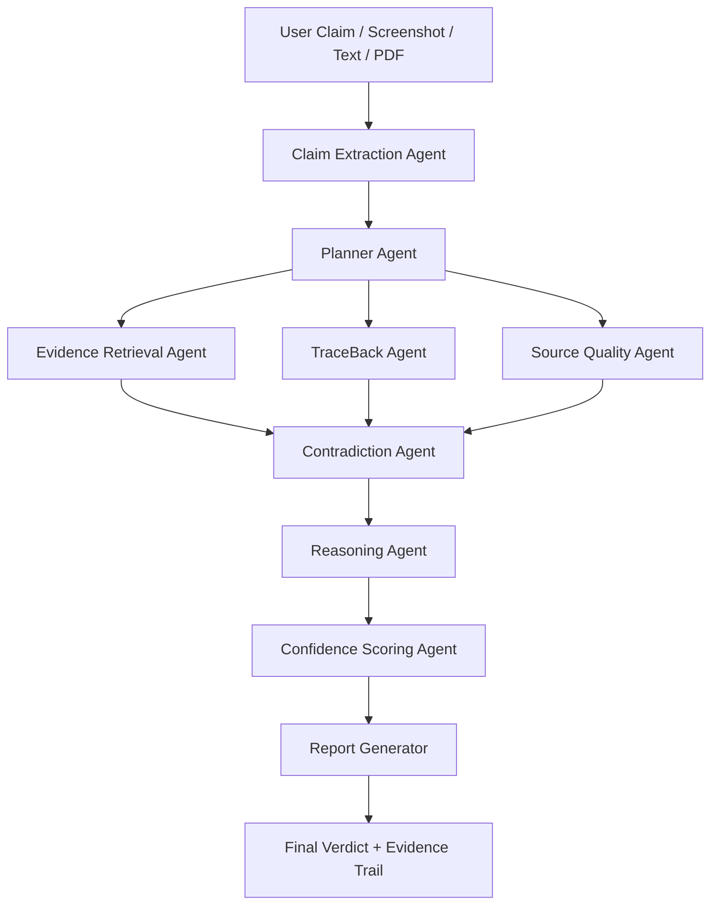

# ProofPath AI

## Tagline
**Stop trusting AI answers. Start trusting evidence trails.**

## What is ProofPath AI?
ProofPath AI is an agentic AI application that verifies claims by building an evidence-backed reasoning trail before producing a final answer.

This updated version integrates selected features from **TraceBack AI**, turning ProofPath into a hybrid system that can not only verify whether a claim is likely true, but also investigate:

- where the claim may have originated,
- how it changed over time,
- which sources repeated it,
- what primary evidence exists,
- what contradictions appear across sources,
- and what confidence level should be assigned.

## Core Idea
Most AI tools answer questions immediately.

ProofPath AI behaves differently.

It first asks:

> What is the claim?
> Where did it come from?
> What evidence supports it?
> What evidence challenges it?
> Has the claim mutated over time?
> Which sources are trustworthy?
> What should the user believe?

## Example Use Cases

### 1. Health Claim Verification
User:  
> Does creatine damage kidneys?

ProofPath investigates medical guidelines, PubMed papers, systematic reviews, contraindications, and contradictions before answering.

### 2. Viral Claim Traceback
User:  
> I saw a claim that drinking cold water after meals causes cancer. Is this true?

ProofPath searches for earlier appearances of the claim, checks health authorities, tracks repeated versions, and finds whether any primary evidence exists.

### 3. Product Claim Investigation
User:  
> This supplement brand says it increases testosterone by 300%. Is that real?

ProofPath extracts the claim, searches studies, checks marketing language, finds regulatory warnings if available, and assigns a confidence score.

### 4. AI Answer Verification
User uploads an AI-generated answer.

ProofPath decomposes it into claims, verifies each claim separately, finds contradictions, and generates a corrected evidence report.

## Main Agentic Workflow



## Core Agents

| Agent | Responsibility |
|---|---|
| Claim Extraction Agent | Extracts clean claims from text, screenshots, PDFs, tweets, or AI answers |
| Planner Agent | Decides which tools and sources are needed |
| Evidence Retrieval Agent | Finds supporting and opposing evidence |
| TraceBack Agent | Searches for earliest known appearances and claim mutations |
| Source Quality Agent | Scores source reliability |
| Contradiction Agent | Detects disagreement between sources |
| Reasoning Agent | Builds the final evidence-based explanation |
| Confidence Scoring Agent | Assigns confidence based on quality, recency, agreement, and primary evidence |
| Report Generator | Creates a shareable investigation report |

## Tools Used

Minimum build tools:

- LLM API: Gemini / OpenAI / Claude / Groq
- Web Search: Tavily / Serper / DuckDuckGo
- arXiv API
- Semantic Scholar API
- PubMed API
- PDF parser
- OCR for screenshots
- Python calculator/scoring engine
- SQLite for implemented structured memory
- ChromaDB for optional future vector memory

Optional advanced tools:

- Google Trends
- News API
- YouTube transcript search
- WHOIS lookup
- VirusTotal for suspicious links
- Browser scraper
- Timeline visualization

## Memory Implementation

ProofPath maintains:

1. **Session Memory**  
   Stores the current investigation state.

2. **Case Memory**  
   Stores previous investigations, verdicts, claim versions, sources, and reports.

3. **Source Preference Memory**  
   Remembers user preferences such as:
   - prefers primary sources,
   - prefers peer-reviewed papers,
   - avoids Reddit/social media unless tracing origin,
   - wants simple explanations.

4. **Claim Graph Memory**  
   Stores recurring claims and related variants.

Example:

```json
{
  "claim": "Creatine damages kidneys",
  "variants": [
    "Creatine causes kidney failure",
    "Creatine is unsafe for long-term use",
    "Creatine raises creatinine so it damages kidneys"
  ],
  "verdict": "Mostly unsupported for healthy adults",
  "confidence": 0.82,
  "last_checked": "2026-06-26"
}
```

## Why This Is Agentic

ProofPath is not a simple chatbot because it:

- plans an investigation,
- chooses tools autonomously,
- searches multiple source types,
- compares evidence,
- detects contradictions,
- builds a timeline,
- remembers previous cases,
- makes a confidence-based decision,
- and generates a structured report.

## Recommended Tech Stack

### Frontend
- Next.js + Tailwind CSS + shadcn/ui  
or  
- Streamlit for faster 3-day implementation

### Backend
- FastAPI
- LangGraph
- Python

### Memory
- SQLite
- ChromaDB optional roadmap item

### Reports
- ReportLab / WeasyPrint / Markdown export

## 3-Day MVP Scope

### Must Build
- Claim input
- Basic planner
- Web search tool
- Source quality scoring
- TraceBack timeline
- Contradiction detection
- Persistent case memory
- Final verdict report
- Polished frontend

### Skip for MVP
- Real-time social media APIs
- Full browser automation
- Complex knowledge graph
- User authentication
- Production deployment security

## Demo Video Flow

1. Input a viral claim.
2. Show the agent extracting the claim.
3. Show the planner selecting tools.
4. Show sources being collected.
5. Show the TraceBack timeline.
6. Show contradictions.
7. Show confidence score.
8. Show final report.
9. Refresh app and show case memory.

## Repository Positioning

This project can be positioned as:

> An agentic evidence verification engine with provenance tracing and confidence scoring.

Good LinkedIn/GitHub headline:

> Built ProofPath AI — a multi-agent claim verification system that traces claim origins, detects contradictions, ranks evidence quality, and generates evidence-backed verdicts using LangGraph, LLM tools, and persistent memory.
