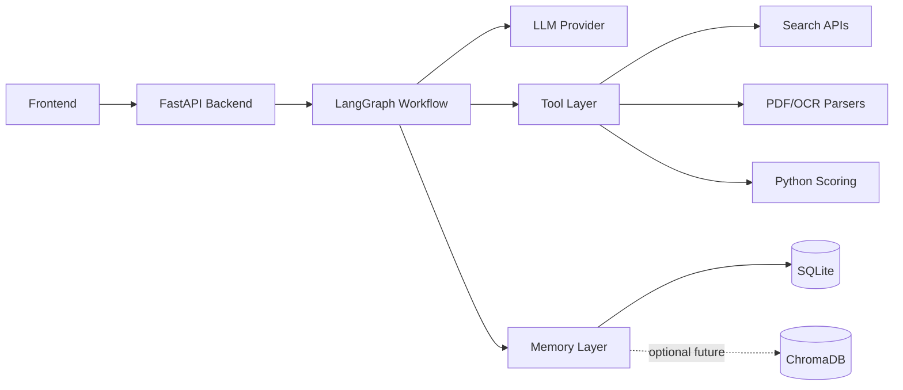
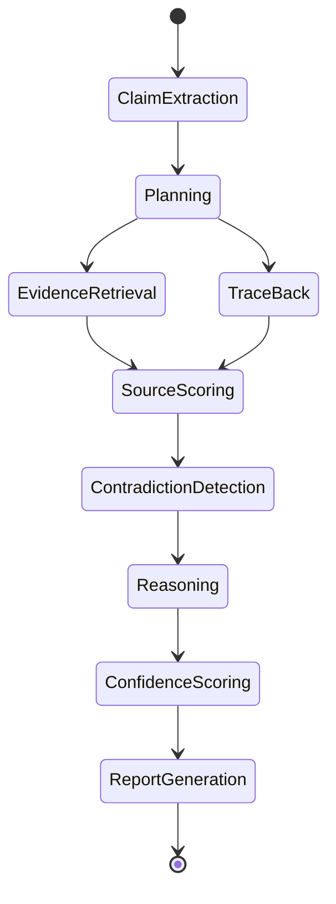

# Technical Requirements Document: ProofPath AI

## 1. System Overview
ProofPath AI is a multi-agent evidence verification system with TraceBack-style claim provenance features.

It accepts user claims, uploaded text, screenshots, or PDFs, then performs a structured investigation using LLM agents, search tools, document parsers, scoring functions, and persistent memory.

## 2. Core Architecture



## 3. Recommended Stack

### Frontend
Fast version:
- Streamlit

Portfolio version:
- Next.js
- Tailwind CSS
- shadcn/ui
- Framer Motion
- React Flow for graphs

### Backend
- Python
- FastAPI
- LangGraph
- Pydantic

### LLM
One of:
- Gemini
- OpenAI
- Claude
- Groq

### Database
- SQLite for implemented case memory
- ChromaDB for optional future vector memory

### File Processing
- PyMuPDF
- pdfplumber
- pytesseract or EasyOCR
- Pillow

### Search
- Tavily
- Serper
- DuckDuckGo search
- arXiv API
- Semantic Scholar API
- PubMed API

### Report Generation
- Markdown
- ReportLab
- WeasyPrint

## 4. Agent Definitions

### 4.1 Claim Extraction Agent
Input:
- user text
- screenshot OCR
- PDF text

Output:
```json
{
  "main_claim": "...",
  "sub_claims": ["...", "..."],
  "claim_type": "health | tech | finance | politics | product | general",
  "entities": ["..."],
  "risk_level": "low | medium | high"
}
```

### 4.2 Planner Agent
Decides:
- which tools are required,
- which sources are reliable for this claim,
- whether origin tracing is useful,
- whether scientific databases are needed,
- whether contradiction analysis is needed.

Output:
```json
{
  "plan": [
    "Search primary sources",
    "Search academic databases",
    "Trace earliest accessible appearance",
    "Compare claim variants",
    "Score evidence quality"
  ],
  "tools": ["web_search", "semantic_scholar", "traceback_search"]
}
```

### 4.3 Evidence Retrieval Agent
Searches for:
- supporting evidence,
- opposing evidence,
- neutral context,
- primary sources,
- expert sources.

### 4.4 TraceBack Agent
Responsible for:
- finding earlier mentions,
- identifying repeated wording,
- detecting claim mutation,
- creating timeline entries.

Output:
```json
{
  "timeline": [
    {
      "date": "2021-03-14",
      "source": "blog",
      "claim_version": "...",
      "quality": "low"
    }
  ],
  "earliest_accessible_source": "...",
  "mutation_summary": "Claim became more exaggerated over time."
}
```

### 4.5 Source Quality Agent
Scores each source.

Factors:
- source type,
- author credibility,
- citation presence,
- recency,
- primary vs secondary,
- reputation,
- conflict of interest,
- sensational language.

### 4.6 Contradiction Agent
Finds:
- source disagreements,
- unsupported leaps,
- exaggerated claims,
- missing context,
- outdated evidence.

### 4.7 Confidence Scoring Agent
Calculates final confidence.

Suggested formula:
```text
confidence =
  0.30 * source_quality
+ 0.25 * evidence_consistency
+ 0.20 * primary_source_strength
+ 0.15 * recency
+ 0.10 * traceback_clarity
```

### 4.8 Report Agent
Generates:
- final verdict,
- evidence table,
- contradiction table,
- traceback timeline,
- confidence score,
- next steps.

## 5. Tool Layer

### 5.1 web_search(query)
Searches general web.

### 5.2 academic_search(query)
Searches academic sources.

### 5.3 traceback_search(claim)
Searches for earlier versions of a claim.

### 5.4 parse_pdf(file)
Extracts text from PDF.

### 5.5 ocr_image(file)
Extracts text from screenshot.

### 5.6 score_source(source)
Computes reliability score.

### 5.7 generate_report(case_id)
Creates markdown or PDF report.

## 6. Memory Design

### SQLite Tables

```sql
CREATE TABLE cases (
    id TEXT PRIMARY KEY,
    user_id TEXT,
    title TEXT,
    original_claim TEXT,
    verdict TEXT,
    confidence REAL,
    created_at TEXT,
    updated_at TEXT
);

CREATE TABLE sources (
    id TEXT PRIMARY KEY,
    case_id TEXT,
    title TEXT,
    url TEXT,
    source_type TEXT,
    quality_score REAL,
    stance TEXT,
    published_date TEXT
);

CREATE TABLE timeline_events (
    id TEXT PRIMARY KEY,
    case_id TEXT,
    event_date TEXT,
    source_url TEXT,
    claim_version TEXT,
    notes TEXT
);

CREATE TABLE memories (
    id TEXT PRIMARY KEY,
    user_id TEXT,
    memory_type TEXT,
    content TEXT,
    created_at TEXT
);
```

### Optional Future Vector Memory
If added later, store:
- claim embeddings,
- source excerpts,
- verdict summaries,
- user preferences.

## 7. API Endpoints

### POST /api/investigate
Starts investigation.

Request:
```json
{
  "user_id": "demo",
  "claim": "Cold water after meals causes cancer"
}
```

### GET /api/cases
Returns previous cases.

### GET /api/cases/{case_id}
Returns full investigation.

### POST /api/upload
Uploads PDF/image.

### GET /api/report/{case_id}
Downloads report.

## 8. State Machine



## 9. MVP Constraints
For a 3-day build:
- Use Streamlit if speed matters.
- Use Tavily + DuckDuckGo instead of too many APIs.
- Mock social trend tracing using search results.
- Store implemented memory in SQLite.
- Generate Markdown and PDF reports from the persisted investigation.

## 10. Security Requirements
- Do not expose API keys.
- Store keys in `.env`.
- Do not upload sensitive user data to unnecessary third-party services.
- Add disclaimers for health/legal/financial claims.
- Let users delete case memory.

## 11. Testing Requirements
- Test claim extraction.
- Test search tool wrapper.
- Test source scoring.
- Test confidence scoring.
- Test memory persistence.
- Test report generation.
